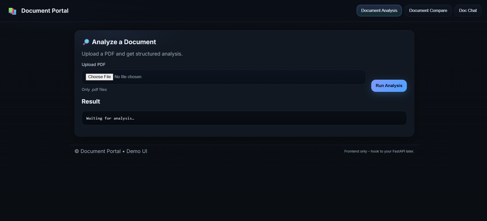
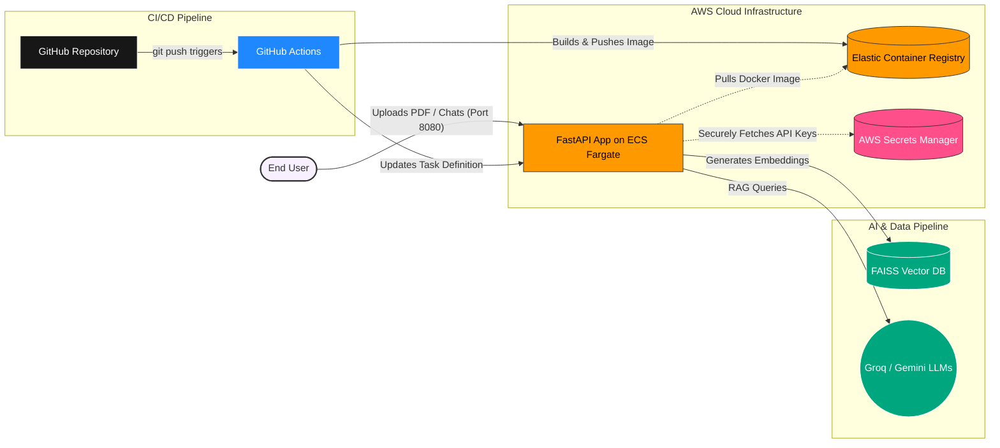
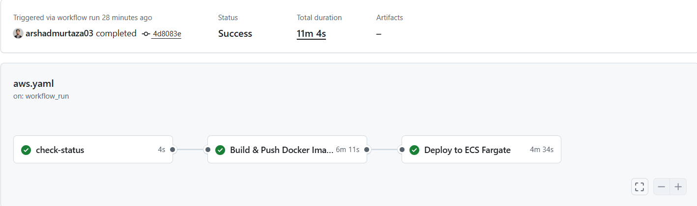

# 📄 Document Portal


---

## 📖 Overview

Document Portal is a FastAPI-based web application for analyzing, comparing, and chatting with documents using LLMs. Upload PDFs to get automated summaries, compare two versions side-by-side, and ask natural-language questions over your files using a RAG (Retrieval-Augmented Generation) pipeline.

The project demonstrates end-to-end AI engineering — an **LLM + RAG workflow (LangChain + embeddings + FAISS)** built into a production FastAPI app, containerized with Docker, and deployed to AWS with a full **CI/CD pipeline.**

---

## 📸 Application Preview



---

## ✨ Features

- **Document Analysis** — Upload a PDF and receive a structured, automated analysis.
- **Document Compare** — Upload two versions of a document for side-by-side evaluation.
- **Doc Chat** — Ask natural-language questions over your uploaded documents via a conversational interface.
- **Production-Ready API** — High-performance FastAPI backend with async support.

---

## 🏗️ Architecture


---

## 🛠️ Tech Stack

| Layer | Technology |
|---|---|
| Backend | FastAPI (Python 3.12) |
| AI / RAG | LangChain, FAISS, Groq, Gemini |
| Frontend | HTML / CSS |
| Containerization | Docker |
| Compute | AWS ECS (Fargate) |
| Image Registry | AWS ECR |
| Infrastructure as Code | AWS CloudFormation |
| CI/CD | GitHub Actions |
| Secrets Management | AWS Secrets Manager |
| Testing | Pytest |
| Environment | Conda |

---

## 🔐 Security

- **Secrets** — API keys are stored in `.env` locally (see `.env.example`) and in AWS Secrets Manager in production. They are never committed to Git.
- **Least Privilege** — ECS Task Role and IAM policies are scoped only to what is needed: ECR pulls, Secrets Manager reads, and CloudWatch log publishing.
- **Git Hygiene** — `.env`, virtual environments, FAISS indices, data directories, and build artifacts are excluded via `.gitignore`.

---

## 🚀 CI/CD Pipeline



Two GitHub Actions workflows handle the full pipeline:

1. **Continuous Integration (`ci.yaml`)** — On every push to `main`, sets up Python 3.12, installs dependencies from `requirements.txt`, and runs the full `pytest` suite.
2. **Continuous Deployment (`aws.yaml`)** — If CI passes, builds the Docker image, tags it with the commit SHA, pushes it to ECR, and updates the ECS Task Definition to roll out the new container on Fargate with zero downtime.

---

## 💻 Local Development

### Prerequisites

Ensure the following are installed before proceeding:

- [Conda](https://docs.conda.io/en/latest/miniconda.html)
- Python 3.12
- [Docker](https://docs.docker.com/get-docker/) (optional, for container builds)

### Step 1 — Clone the repository
```bash
git clone https://github.com/arshadmurtaza03/document_portal.git
cd document_portal
```

### Step 2 — Create and activate the environment
```bash
conda create -p venv python=3.12 -y
conda activate ./venv
```

### Step 3 — Install dependencies
```bash
pip install -r requirements.txt
```

### Step 4 — Configure API keys
```bash
cp .env.example .env
```

Open `.env` and fill in the following keys:

| Variable | Description |
|---|---|
| `GROQ_API_KEY` | API key from [console.groq.com](https://console.groq.com) |
| `GEMINI_API_KEY` | API key from [Google AI Studio](https://aistudio.google.com) |

### Step 5 — Start the server
```bash
uvicorn api.main:app --host 0.0.0.0 --port 8080 --reload
```

Open [http://localhost:8080](http://localhost:8080) in your browser.

### Step 6 — Run tests
```bash
pytest tests/
```

---

## ☁️ AWS Deployment

Infrastructure is defined in `document-portal-cf.yaml` (AWS CloudFormation). To deploy from scratch:

1. Bootstrap the stack via CloudFormation (creates VPC, ECS cluster, ECR repo, IAM roles, and Secrets Manager entries).
2. Add `GROQ_API_KEY` and `GEMINI_API_KEY` to AWS Secrets Manager under the names referenced in the CloudFormation template.
3. Add the following secrets to your GitHub repository (`Settings → Secrets and variables → Actions`):

| Secret | Description |
|---|---|
| `AWS_ACCESS_KEY_ID` | IAM user access key |
| `AWS_SECRET_ACCESS_KEY` | IAM user secret key |
| `AWS_REGION` | e.g. `ap-southeast-2` |
| `ECR_REPOSITORY` | ECR repository URI |
| `ECS_CLUSTER` | ECS cluster name |
| `ECS_SERVICE` | ECS service name |

4. Push to `main` — the CI/CD pipeline handles the rest.

---

## 📄 License

Released under the **MIT License** — see [`LICENSE`](LICENSE).